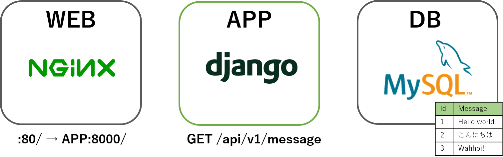

# handson-docker

## はじめに
- このリポジトリはJBグループ社内向けのdockerを使用した開発ハンズオン用です
- Windows環境を前提としています
- 初めてdockerにチャレンジする人を対象としています

## ハンズオンのゴール
- Dockerを使った開発のイメージをもってもらう


## 事前準備
- dockerのインストール
   - Windows 10 [Docker for Windows](https://docs.docker.com/docker-for-windows/
)
   - Windows 7 or 8 or 8.1  [Docker Toolbox](https://docs.docker.com/toolbox/toolbox_install_windows/#what-you-get-and-how-it-works) 

- gitのインストール
  - [git for windows](https://gitforwindows.org/)

- Visual Studio Codeのインストール
  - [Visual Studio Code for Windows](https://code.visualstudio.com/)

- GitHub ユーザー作成
  - https://github.com/

- Docker Hub ユーザー作成
  - https://hub.docker.com/

## 基本操作
### コンテナを動かすチュートリアル
コマンドのオプションは-hで確認しましょう
- docker hubへのログイン  
  ```
  docker login -u <ユーザー名> -p <パスワード>
  ```
- docker image の検索  
  ```
  docker search <イメージ名>
  ```
- イメージの取得
  ```
  docker pull <イメージ名>
  ```
- イメージの確認
  ```
  docker images <イメージ名>
  REPOSITORY                                 TAG                 IMAGE ID            CREATED             SIZE  
  nginx                                      latest              dbfc48660aeb        2 weeks ago         109MB
  ```
- コンテナの起動
  ```
  docker run <イメージ名>
  ```
  #### 主なオプション  
  -d                                                   // デーモン実行  
  -e <環境変数名>=<値>                                  // 環境変数を渡す  
  -p <ホストのポート>:<コンテナのポート>		          // ホストマシンのポートとリンク  
  -v <ホストのディレクトリ>:<コンテナのディレクトリ>	   // ローカルディスクをマウント  
  --name <名前>				                           // コンテナに名前を指定  

  例)
  ```
  docker run -d -p 18080:80 nginx
  ```
  起動したらブラウザでhttp://localhost:18080へアクセス  
  nginxのトップページが表示されれば成功

- コンテナの一覧表示
  ```
  docker ps
  ```
- コンテナの詳細表示
  ```
  docker inspect <コンテナID or コンテナ名>
  ```
- コンテナのログ表示
  ```
  docker logs <コンテナID or コンテナ名>
  ```
- コンテナの停止 
  ```
  docker stop <コンテナID or コンテナ名>
  ```
- 停止していたコンテナの起動
  ```
  docker start <コンテナID or コンテナ名>
- コンテナの削除
  ```
  docker rm <コンテナID or コンテナ名>
  ```
- コンテナイメージの削除
  ```
  docker rmi <イメージID>
  ```

### Dockerfile
#### オレオレnginxコンテナを作ろう
- Dockerfileの作成(お好きなエディタで以下を作成し、「Dockerfile」という名前で保存)
  ```
  FROM debian:buster-slim
  MAINTAINER メンテナ名 <メールアドレス>
  RUN apt-get update && apt-get install nginx -y
  EXPOSE 80
  CMD ["nginx", "-g", "daemon off;"]
  ```
  サンプル: nginx/Dockerfile

- イメージの作成
  ```
  docker build [–t タグ] <Dockerfileのあるディレクトリ>
  ```

### Docker Compose
Docker Composeを使用すると、複数のコンテナを同時に起動できます。  
また、コンテナ同士を接続したり、起動時のパラメータをセットできます。

#### オレオレnginxコンテナを Docker Compose で起動しよう
- docker-compose.ymlの作成
  ```
  version: '3'
  services:
    web:
      build:
        context: .
      ports: 
         - "80:80"
  ```

- docker-composeでの起動
  ```
  docker-compose up
  ```

サンプルが```./nginx```にあります

## 開発ハンズオン

### ハンズオンの概要
アプリケーションサーバーとデータベースをコンテナで起動し、動作確認をローカルで行えるようにします。
アプリケーションのみ変更したらコンテナを置き換えて動作確認できる流れを体験していただきます。

### 初期構成


1. 当リポジトリをcloneする
  ```git clone https://github.com/nidcode/handson-docker.git```

2. コンテナを起動する
　※docker imageをpullするので、テザリング等で実施するのはお控えください。
    - ```cd docker-handson```
    - ```docker-compose run -d -p 80:8000 app python mysite/manage.py runserver 0:8000```

3. 動作を確認する
    - ブラウザから```http://localhost/```を表示
    - Djangoの初期画面が表示されます

4. データベースを初期設定する
    - ```docker-compose run app python mysite/manage.py migrate```

5. データベースへの接続情報を環境変数化する
    - ソースコード内に秘匿情報が入るのはセキュリティ上よくないので、環境変数でセットするように変更します。
    1. docker-compose.yml
        ```
        ```
    2. mysite/mysite/settings.py
        ```
        ```

7. コードを追加する
    - サンプルを見ながら頑張ってみてください

8. コードをテストする
    - ```docker-compose up```
    - postmanやcurl等でPOSTやDELETEを試してみてください  
    POSTの例
      - ```curl -H 'Content-Type: Application/json' -XPOST http://localhost/api/v1/messages/4 -d '{"message":"wahhooooi!"}'```
      - ```curl http://localhost/api/v1/messages/4```

9. コンテナを終了する
    - ```docker-compose down```